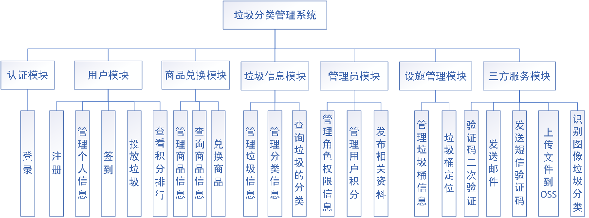

​		本系统采用B/S架构，进行前后端分离开发，前端使用Vue、TypeScript和ElementPlus开发，后端采用SpringCloud Alibaba框架搭建微服务系统，数据库使用Mysql存储用户、垃圾及其分类信息，使用Redis存储用户签到、验证码等信息，将垃圾信息存储在ElasticSearch中完成全文检索，将垃圾设施位置信息存储在Mongodb中完成对于附近垃圾设施的查找、寻路等功能，通过Canal保证数据的一致性。通过分析垃圾分类管理模式，基于微服务思想，设计并实现系统各个模块，增加垃圾正确分类的积极性。

​	本系统主要分为认证模块、用户模块、商品兑换模块、垃圾信息模块、管理员模块、设施管理模块和三方服务模块。

​		本系统角色主要分为管理员和游客。用户可以完成投递垃圾信息，兑换商品，查看垃圾信息、商品信息、公告信息、垃圾设施信息、积分排行榜，管理个人信息、购物车、订单信息等功能。而管理员可以对垃圾、垃圾设施、用户投递垃圾、用户、角色、权限、商品、公告等信息进行增删查改。

界面图：

